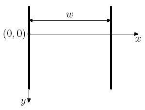
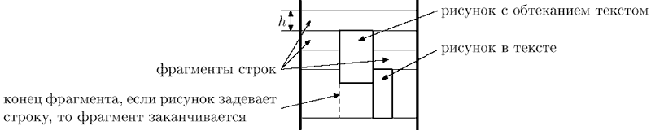

Здесь собраны решения решения самых интересных и сложных задач с Яндекс Тренировок по алгоритмам 5.0.
(Решения не претендуют на единствено верные и призваны вдохновить или помочб подверпнут идею в случае затруднения с решением)

## Содержание
Контест 1
1. J. Формирование документа 

Вася пишет новую версию своего офисного пакета "Closed Office". Недавно он начал работу над редактором "Dword", входящим в состав пакета.

Последняя проблема, с которой столкнулся Вася — размещение рисунков в документе. Он никак не может добиться стабильного отображения рисунков в тех местах, в которые он их помещает. Окончательно отчаявшись написать соответствующий модуль самостоятельно, Вася решил обратиться за помощью к вам. Напишите программу, которая будет осуществлять размещение документа на странице.

Документ в формате редактора "Dword" представляет собой последовательность абзацев. Каждый абзац представляет собой последовательность элементов – слов и рисунков. Элементы одного абзаца разделены пробелами и/или переводом строки. Абзацы разделены пустой строкой. Строка, состоящая только из пробелов, считается пустой.

Слово — это последовательность символов, состоящая из букв латинского алфавита, цифр, и знаков препинания: ".", ",", ":", ";", "!", "?", "-", "'".

Рисунок описывается следующим образом: "(image image parameters)". Каждый параметр рисунка имеет вид "имя=значение". Параметры рисунка разделены пробелами и/или переводом строки. У каждого рисунка обязательно есть следующие параметры:

width — целое положительное число, ширина рисунка в пикселях height — целое положительное число, высота рисунка в пикселях layout — одно из следующих значений: embedded (в тексте), surrounded (обтекание текстом), floating (свободное), описывает расположение рисунка относительно текста

Документ размещается на бесконечной вверх и вниз странице шириной w пикселей (разбиение на конечные по высоте страницы планируется в следующей версии редактора). Одна из точек на левой границе страницы условно считается точкой с ординатой равной нулю. Ордината увеличивается вниз.

Размещение документа происходит следующим образом. Абзацы размещаются по очереди. Первый абзац размещается так, что его верхняя граница имеет ординату 0.

Абзац размещается следующим образом. Элементы располагаются по строкам. Каждая строка исходно имеет высоту h пикселей. В процессе размещения рисунков высота строк может увеличиваться, и строки могут разбиваться рисунками на фрагменты.

Слова размещаются следующим образом. Считается, что каждый символ имеет ширину c пикселей. Перед каждым словом, кроме первого во фрагменте, ставится пробел шириной также в c пикселей. Если слово помещается в текущем фрагменте, то оно размещается на нем. Если слово не помещается в текущем фрагменте, то оно размещается в первом фрагменте текущей строки, расположенном правее текущего, в котором оно помещается. Если такого фрагмента нет, то начинается новая строка, и поиск подходящего фрагмента продолжается в ней. Слово всегда "прижимается" к верхней границе строки.

Размещение рисунка зависит от его расположения относительно текста.

Если расположение рисунка относительно текста установлено в "embedded", то он располагается так же, как слово, за тем исключением, что его ширина равна ширине, указанной в параметрах рисунка. Кроме того, если высота рисунка больше текущей высоты строки, то она увеличивается до высоты рисунка (при этом верхняя граница строки не перемещается, а смещается вниз нижняя граница). Если рисунок типа "embedded" не первый элемент во фрагменте, то перед ним ставится пробел шириной c пикселей. Рисунки типа "embedded" также прижимаются к верхней границе строки.

Если расположение рисунка относительно текста установлено в "surrounded", то рисунок размещается следующим образом. Сначала аналогично находится первый фрагмент, в котором рисунок помещается по ширине. При этом перед рисунком этого типа не ставится пробел, даже если это не первый элемент во фрагменте.

После этого рисунок размещается следующим образом: верхний край рисунка совпадает с верхней границей строки, в которой находится найденный фрагмент, а сам рисунок продолжается вниз. При этом строки, через которые он проходит, разбиваются им на фрагменты.

Если расположение рисунка относительно текста установлено в "floating", то рисунок размещается поверх текста и других рисунков и никак с ними не взаимодействует. В этом случае у рисунка есть два дополнительных параметра: "dx" и "dy" — целые числа, задающие смещение в пикселях верхнего левого угла рисунка вправо и вниз, соответственно, относительно позиции, где находится верхний правый угол предыдущего слова или рисунка (или самой левой верхней точки первой строки абзаца, если рисунок — первый элемент абзаца).

Если при размещении рисунка таким образом он выходит за левую границу страницы, то он смещается вправо, так, чтобы его левый край совпадал с левой границей страницы. Аналогично, если рисунок выходит за правую границу страницы, то он смещается влево, чтобы его правый край совпадал с правой границей страницы.

Верхняя граница следующего абзаца совпадает с более низкой точкой из нижней границы последней строки и самой нижней границы рисунков типа "surrounded" предыдущего абзаца.

По заданным w, h, c и документу найдите координаты верхних левых углов всех рисунков в документе.

Формат ввода
Первая строка входного файла содержит три целых числа: w, h и c (1 ≤ w ≤ 1000, 1 ≤ h ≤ 50, 1 ≤ c ≤ w).

Далее следует документ. Размер входного файла не превышает 1000 байт. Гарантируется, что ширина любого слова и любого рисунка не превышает w. Высота всех рисунков не превышает 1000. Относительное смещение всех рисунков типа «floating» не превышает 1000 по абсолютной величине.

Формат вывода
Выведите в выходной файл по два числа для каждого рисунка — координаты его верхнего левого угла. Выводите координаты рисунков в том порядке, в котором они встречаются во входном файле.

Решение: [J. Формирование документа](special cases/J. Document formation.py)

Контест 2
1. E. Амбициозные улитки

Домашний питомец мальчика Васи — улитка Петя, живет на бесконечном вертикальном столбе, который можно представить как числовую прямую. Изначально Петя находится в точке 0. 

Вася кормит Петю ягодами. У него есть **n** ягод, каждая в единственном экземпляре. Если утром Вася даст Пете ягоду с номером **i**, то за день Петя поднимется на **aᵢ** единиц вверх, а за ночь опустится на **bᵢ** единиц вниз. Параметры различных ягод могут совпадать.

Пете стало интересно, как высоко он сможет подняться. Вася решил помочь, планируя кормить Петю ягодами в течение **n** дней так, чтобы максимальная высота, которой достигнет улитка, была наибольшей. Вася не умеет программировать, поэтому попросил вас о помощи.

Ваша задача — найти максимальную высоту, которой сможет достичь Петя, а также порядок, в котором Вася должен кормить его ягодами.

Формат ввода:
В первой строке дано число **n** (1 ≤ n ≤ 5⋅10⁵) — количество ягод у Васи.  
В следующих **n** строках описаны параметры каждой ягоды:
В строке **i + 1** даны два числа **aᵢ** и **bᵢ** (0 ≤ aᵢ, bᵢ ≤ 10⁹):
**aᵢ** — на сколько поднимется улитка за день после съеденной ягоды.
**bᵢ** — на сколько опустится улитка за ночь.

Формат вывода:
В первой строке выведите одно число — максимальную высоту, которую сможет достичь Петя.  Во второй строке выведите **n** различных целых чисел от 1 до **n** — порядок, в котором Вася должен кормить Петю (каждое число соответствует номеру ягоды, которую Вася должен дать Пете в соответствующий день).

Решение: [E. Амбиционзыне улитки](special cases/J. Document formation.py)

2. J. Два прямоугольника

Недавно один известный художник-абстракционист произвел на свет новый шедевр — картину «Два черных непересекающихся прямоугольника». Картина представляет собой прямоугольник m× n, разбитый на квадраты 1× 1, некоторые из которых закрашены любимым цветом автора — черным. Федя — не любитель абстрактных картин, однако ему стало интересно, действительно ли на картине изображены два непересекающихся прямоугольника. Помогите ему это узнать. Прямоугольники не пересекаются в том смысле, что они не имеют общих клеток.

Формат ввода
Первая строка входного файла содержит числа m и n (1 ≤ m, n ≤ 200). Следующие m строк содержат описание рисунка. Каждая строка содержит ровно n символов. Символ «.» обозначает пустой квадрат, а символ «#» — закрашенный.

Формат вывода
Если рисунок можно представить как два непересекающихся прямоугольника, выведите в первой строке «YES», а в следующих m строках выведите рисунок в том же виде, в каком он задан во входном файле, заменив квадраты, соответствующие первому прямоугольнику на символ «a», а второму — на символ «b». Если решений несколько, выведите любое.

Если же этого сделать нельзя, выведите в выходной файл «NO».

Решение: [J. Два прямоугольника](special cases/J. Document formation.py)

Контест 3
1. I. Играйте в фубол

Ася Вуткина — известный футбольный комментатор. Будучи профессионалом своего дела, Ася тщательно следит за всеми матчами всех европейских чемпионатов.

Благодаря накопленной информации, Ася может во время трансляции матча сообщить какую-нибудь интересную статистику, например: «Индзаги третий матч подряд забивает гол на 9-й минуте» или «Матерацци никогда не открывает счет в матче».

Но мозг Аси не безграничен, а помнить всю историю футбола просто невозможно. Поэтому Ася попросила вас написать программу, которая собирает статистику матчей и умеет отвечать на некоторые запросы, касающиеся истории футбола.

Информация о матче сообщается программе в следующей форме:

"<Название 1-й команды>" - "<Название 2-й команды>" <Счет 1-й команды>:<Счет 2-й команды>

<Автор 1-го забитого мяча 1-й команды> <Минута, на которой был забит мяч>'

<Автор 2-го забитого мяча 1-й команды> <Минута, на которой был забит мяч>'

...

<Автор последнего забитого мяча 1-й команды> <Минута, на которой был забит мяч>'

<Автор 1-го забитого мяча 2-й команды> <Минута, на которой был забит мяч>'

...

<Автор последнего забитого мяча 2-й команды> <Минута, на которой был забит мяч>'

Запросы к программе бывают следующих видов:

Total goals for <Название команды>

— количество голов, забитое данной командой за все матчи.

Mean goals per game for <Название команды>

— среднее количество голов, забиваемое данной командой за один матч. Гарантирутся, что к моменту подачи такого запроса команда уже сыграла хотя бы один матч.

Total goals by <Имя игрока>

— количество голов, забитое данным игроком за все матчи.

Mean goals per game by <Имя игрока>

— среднее количество голов, забиваемое данным игроком за один матч его команды.

Гарантирутся, что к моменту подачи такого запроса игрок уже забил хотя бы один гол.

Goals on minute <Минута> by <Имя игрока>

— количество голов, забитых данным игроком ровно на указанной минуте матча.

Goals on first <T> minutes by <Имя игрока>

— количество голов, забитых данным игроком на минутах с первой по T-ю включительно.

Goals on last <T> minutes by <Имя игрока>

— количество голов, забитых данным игроком на минутах с (91 - T)-й по 90-ю включительно.

Score opens by <Название команды>

— сколько раз данная команда открывала счет в матче.

Score opens by <Имя игрока>

— сколько раз данный игрок открывал счет в матче.

Формат ввода
Входной файл содержит информацию о матчах и запросы в том порядке, в котором они поступают в программу Аси Вуткиной.

Во входном файле содержится информация не более чем о 100 матчах, в каждом из которых забито не более 10 голов. Всего в чемпионате участвует не более 20 команд, в каждой команде не более 10 игроков забивают голы.

Все названия команд и имена игроков состоят только из прописных и строчных латинских букв и пробелов, а их длина не превышает 30. Прописные и строчные буквы считаются различными. Имена и названия не начинаются и не оканчиваются пробелами и не содержат двух пробелов подряд. Каждое имя и название содержит хотя бы одну букву.

Минута, на которой забит гол — целое число от 1 до 90 (про голы, забитые в дополнительное время, принято говорить, что они забиты на 90-й минуте).

Для простоты будем считать, что голов в собственные ворота в европейских чемпионатах не забивают, и на одной минуте матча может быть забито не более одного гола (в том числе на 90-й). Во время чемпионата игроки не переходят из одного клуба в другой.

Количество запросов во входном файле не превышает 500.

Формат вывода
Для каждого запроса во входном файле выведите ответ на этот запрос в отдельной строке. Ответы на запросы, подразумевающие нецелочисленный ответ, должны быть верны с точностью до трех знаков после запятой.

Решение: [I. Играйте в фубол](special cases/J. Document formation.py)

2. J. P2P обновление

В системе умного дома под управлением голосового помощника Лариса n устройств, соединяющихся между собой по сети LoRaWAN. Устройство номер 1 подключено к интернету и на него было скачано обновление, которое необходимо передать на все устройства.

Сеть LoRaWAN очень медленная, поэтому для распространения протокола был придуман peer-to-peer (P2P) протокол. Файл обновления разбивается на k одинаковых по размеру частей, занумерованных от 1 до k.

Передача части обновления происходит во время таймслотов. Каждый таймслот занимает одну минуту. За один таймслот каждое устройство может получить и передать ровно одну часть обновления. То есть устройство во время таймслота может получать новую часть обновления и передавать уже имеющуюуся у него к началу таймслота часть обновления, или совершать только одно из этих действий, или вообще не осуществлять прием или передачу. После приема части обновления устройство может передавать эту часть обновления другим устройствам в следующих таймслотах.

Перед каждым таймслотом для каждой части обновления определяется, на скольких устройствах сети скачана эта часть. Каждое устройство выбирает отсутствующую на нем часть обновления, которая встречается в сети реже всего. Если таких частей несколько, то выбирается отсутствующая на устройстве часть обновления с наименьшим номером.

После этого устройство делает запрос выбранной части обновления у одного из устройств, на котором такая часть обновления уже скачана. Если таких устройств несколько — выбирается устройство, на котором скачано наименьшее количество частей обновления. Если и таких устройств оказалось несколько — выбирается устройство с минимальным номером.

После того, как все запросы отправлены, каждое устройство выбирает, чей запрос удовлетворить. Устройство A удовлетворяет тот запрос, который поступил от наиболее ценного для A устройства. Ценность устройства B для устройства A определяется как количество частей обновления, ранее полученных устройством A от устройства B. Если на устройство A пришло несколько запросов от одинаково ценных устройств, то удовлетворяется запрос того устройства, на котором меньше всего скачанных частей обновления. Если и таких запросов несколько, то среди них выбирается устройство с наименьшим номером.

Далее начинается новый таймслот. Устройства, чьи запросы удовлетворены, скачивают запрошенную часть обновления, а остальные не скачивают ничего.

Для каждого устройства определите, сколько таймслотов понадобится для скачивания всех частей обновления.

Формат ввода
Вводится два числа n и k (2 ≤ n ≤ 100, 1 ≤ k ≤ 200).

Формат вывода
Выведите n-1 число — количество таймслотов, необходимых для скачивания обновления на устройства с номерами от 2 до n.

Решение: [J. P2P обновление](special cases/J. Document formation.py)

Контест 4
1. F. Велодорожки

# Задача: Ширина велодорожек

Мэр города решил проложить велодорожки на главной площади, представляющей собой прямоугольник шириной **w** и высотой **h**, замощённый квадратными плитками размером 1×1. 

## Условия задачи

Мэр хочет проложить:
- **две велодорожки одинаковой ширины**:
  - одну горизонтальную,
  - одну вертикальную.

Плитки на месте велодорожек убираются. Велодорожки должны быть такими, чтобы:
1. После их постройки на площади остались только **целые плитки**.
2. **Ширина дорожек** была минимально возможной целой.

К сожалению, из-за старости площади некоторые плитки уже потрескались, и их координаты заданы в задаче. Мэр не хочет добавлять плитки или менять их местами, он может только убирать существующие плитки.

Ваша задача — определить наименьшую возможную ширину велодорожек.

Формат ввода:
- В первой строке содержатся три целых числа:
  - **w** (1 ≤ w ≤ 10⁹) — ширина площади,
  - **h** (1 ≤ h ≤ 10⁹) — высота площади,
  - **n** (1 ≤ n ≤ min(w × h, 3⋅10⁵)) — количество потрескавшихся плиток.
  
- В следующих **n** строках содержится по два числа:
  - **xᵢ**, **yᵢ** (1 ≤ xᵢ ≤ w, 1 ≤ yᵢ ≤ h) — координаты потрескавшихся плиток.
  
Гарантируется, что все координаты потрескавшихся плиток уникальны:
**(xᵢ, yᵢ) ≠ (xⱼ, yⱼ)** при **i ≠ j**.

Формат вывода: Выведите единственное число:
- **c** (1 ≤ c ≤ min(w, h)) — наименьшую возможную ширину велодорожек.

Решение: [special cases/J. Document formation.py](https://github.com/Tasher239/Yandex-Algo-Train-5.0/blob/main/Binary%20search/F.%20Bike%20paths.py))

2. G. Новый офис плюса

Сервис **Тындекс.Плюс** решил построить новый офис, который должен быть выполнен в форме знака "плюс".  
Участок под застройку — это клетчатое поле **n × m**, где:  
- Часть клеток пригодна для строительства (обозначены символом `#`),  
- Часть клеток непригодна (обозначены символом `.`).  

### Требования к офису:
1. Офис имеет форму знака **"плюс"** размера **k**.  
2. **"Плюс"** размера **k** состоит из пяти квадратов размера **k × k**:
   - Один центральный квадрат,
   - Четыре квадрата — его соседи по сторонам.  
3. Необходимо найти **максимальное значение k**, при котором можно построить офис.  

Гарантируется, что возможно построить офис хотя бы с **k = 1**.

Формат ввода:
В первой строке указаны два целых числа:  **n** (1 ≤ n ≤ 2000) — длина участка, **m** (1 ≤ m ≤ 2000) — ширина участка.
В следующих **n** строках содержится описание участка: Каждая строка — последовательность из **m** символов, где: `#` — клетка пригодна для строительства, `.` — клетка непригодна.

Формат вывода: Выведите одно целое положительное число — **максимально возможное значение k**.

---

## Пример ввода:

Решение: [G. Новый офис плюса](special cases/J. Document formation.py)

3. H. Выборы

В одной демократической стране приближаются парламентские выборы. Выборы проходят по следующей схеме: каждый житель страны, достигший восемнадцатилетнего возраста, отдает свой голос за одну из политических партий. После этого партия, которая набрала максимальное количество голосов, считается победившей на выборах и формирует правительство. Если несколько партий набрали одинаковое максимальное количество голосов, то они должны сформировать коалиционное правительство, что обычно приводит к длительным переговорам.

Один бизнесмен решил выгодно вложить свои средства и собрался поддержать на выборах некоторые партии. В результате поддержки он планирует добиться победы одной из этих партий, которая затем сформирует правительство, которое будет действовать в его интересах. При этом возможность формирования коалиционного правительства его не устраивает, поэтому он планирует добиться строгой победы одной из партий.

Чтобы повлиять на исход выборов, бизнесмен собирается выделить деньги на агитационную работу среди жителей страны. Исследование рынка показало, что для того, чтобы один житель сменил свои политические воззрения, требуется потратить одну условную единицу. Кроме того, чтобы i-я партия в случае победы сформировала правительство, которое будет действовать в интересах бизнесмена, необходимо дать лидеру этой партии взятку в размере pi условных единиц. При этом некоторые партии оказались идеологически устойчивыми и не согласны на сотрудничество с бизнесменом ни за какие деньги.

По результатам последних опросов известно, сколько граждан планируют проголосовать за каждую партию перед началом агитационной компании. Помогите бизнесмену выбрать, какую партию следует подкупить, и какое количество граждан придется убедить сменить свои политические воззрения, чтобы выбранная партия победила, учитывая, что бизнесмен хочет потратить на всю операцию минимальное количество денег.

Формат ввода
В первой строке вводится целое число n – количество партий (1 ≤ n ≤ 105). Следующие n строк описывают партии. Каждая из этих строк содержит по два целых числа: vi – количество жителей, которые собираются проголосовать за эту партию перед началом агитационной компании, и pi – взятка, которую необходимо дать лидеру партии для того, чтобы сформированное ей в случае победы правительство действовало в интересах бизнесмена (1 ≤ vi ≤ 106, 1 ≤ pi ≤ 106 или pi = -1). Если партия является идеологически устойчивой, то pi равно -1. Гарантируется, что хотя бы одно pi не равно -1.

Формат вывода
В первой строке выведите минимальную сумму, которую придется потратить бизнесмену. Во второй строке выведите номер партии, лидеру которой следует дать взятку. В третьей строке выведите n целых чисел – количество голосов, которые будут отданы за каждую из партий после осуществления операции. Если оптимальных решений несколько, выведите любое.

Решение: [H. Выборыа](special cases/J. Document formation.py)

4. I. Лапта

При игре в лапту одна команда ловит мяч и пытается осалить им бегущего. Игрок другой команды должен, перед тем как бежать, ударить мяч в поле. Известно, на какое максимальное расстояние он может ударить, а также скорости и начальные координаты игроков другой команды. Требуется выбрать направление и силу удара так, чтобы минимальное время, которое потребуется другой команде, чтобы поднять мяч с земли, было наибольшим. (Пока мяч летит, игроки стоят на местах).

Формат ввода
В первой строке записаны два числа: D — максимальное расстояние удара и N — количество соперников на поле (D и N натуральные числа, D ≤ 1000, N ≤ 200). В следующих N строках записаны по три числа – начальные координаты xi и yi и максимальная скорость vi соответствующего игрока (скорости и координаты — целые числа, –1000 ≤ xi ≤ 1000, 0 ≤ yi ≤ 1000, 0 < vi ≤ 1000), никакие два игрока не находятся изначально в одной точке. Игрок, бьющий мяч, находится в точке с координатами (0, 0). Мяч выбивается в точку с неотрицательной ординатой (y ≥ 0).

Формат вывода
В выходной файл выведите сначала время, которое потребуется игрокам, чтобы добежать до мяча, а затем координаты точки, в которую нужно выбить мяч. Если таких точек несколько, выведите координаты любой из них. Время и координаты нужно вывести с точностью 10–3.

Решение: [I. Лапта](special cases/J. Document formation.py)
